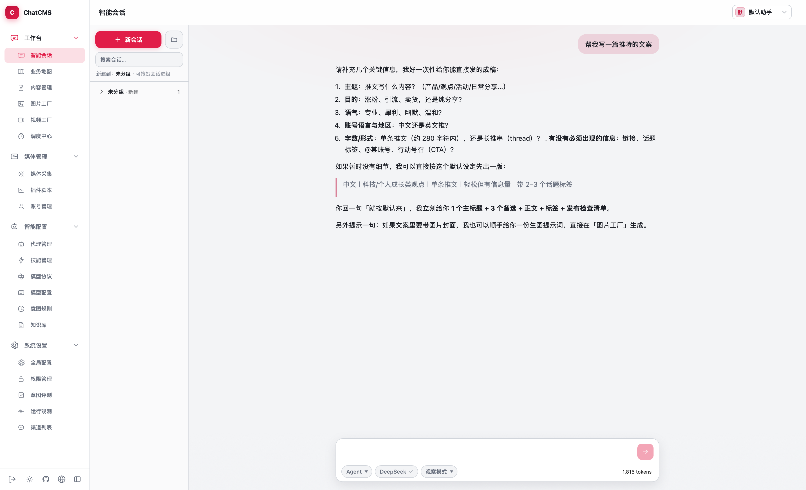
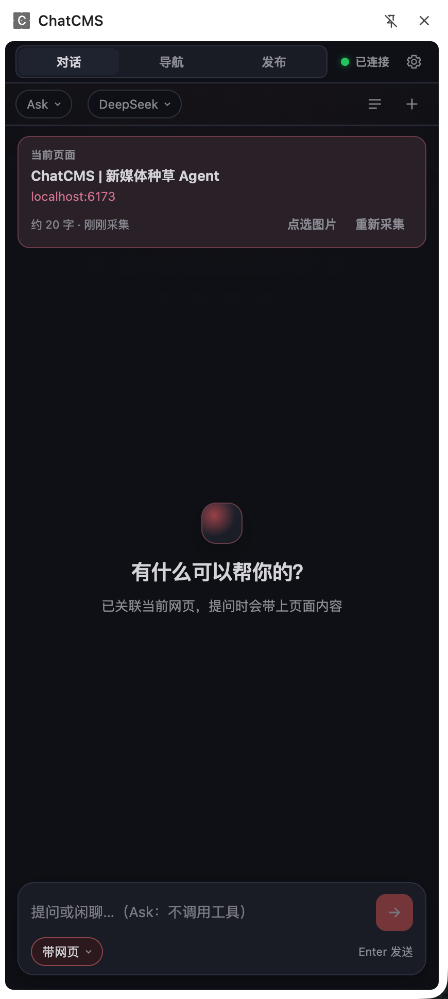
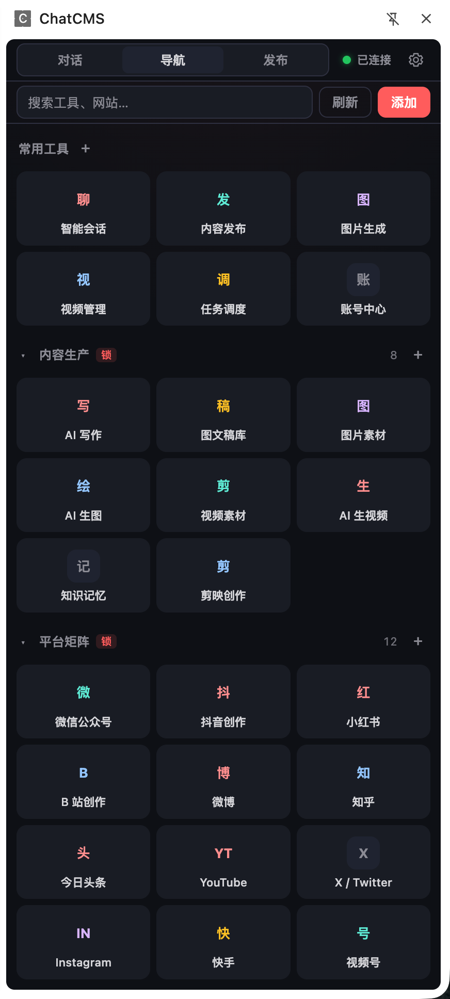
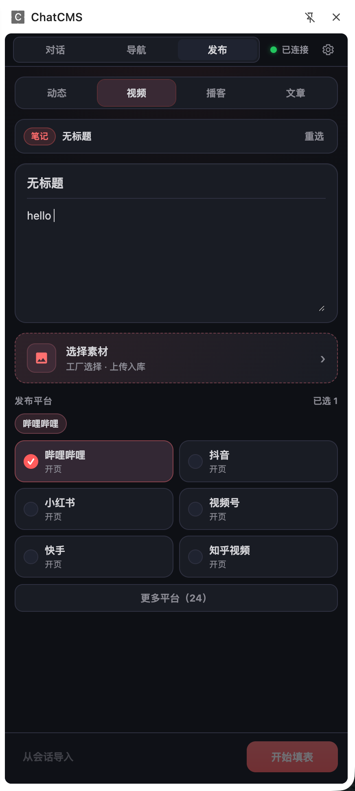

<p align="center">
  
</p>

<h1 align="center">ChatCMS</h1>

<p align="center">
  <strong>开源新媒体种草 Agent</strong><br />
  本地优先 · 采集 · 写作 · 生图生视频 · 多平台发布
</p>

<p align="center">
  <a href="https://chatcms.org/">文档站</a> ·
  <a href="https://chatcms.org/guide/getting-started">快速开始</a> ·
  <a href="https://github.com/bridgehsu/chatcms">GitHub</a>
</p>

<p align="center">
  
  
  
  
</p>

<br />

<p align="center">
  
</p>

---

## 为什么是 ChatCMS

选题、文案、出图、发稿如果拆在十几个工具里，效率会被来回切换吃掉。  
ChatCMS 把种草生产装回一张**本机桌面**：从灵感到发布走同一条链路，数据留在你的机器上。

| 环节 | 你能做什么 |
|------|------------|
| **洞察** | 媒体采集、知识库沉淀爆款与话术 |
| **创作** | 智能会话 + 多 Agent、内容笔记、图片 / 视频工厂 |
| **发布** | 浏览器插件填表、发布桥接、账号保险柜 |
| **运营** | 调度中心、意图规则、权限与会话观测 |

<p align="center">
  
  &nbsp;&nbsp;
  
  &nbsp;&nbsp;
  
  &nbsp;&nbsp;
  
  &nbsp;&nbsp;
  
  &nbsp;&nbsp;
  
  &nbsp;&nbsp;
  
  &nbsp;&nbsp;
  
</p>

<p align="center"><sub>覆盖图文 / 短视频 / 长文等常见创作者平台（更多见文档站）</sub></p>

---

## 工作台一览

| 区域 | 能力 |
|------|------|
| **工作台** | 智能会话、业务地图、内容管理、图片 / 视频工厂、调度中心 |
| **媒体管理** | 采集任务、插件脚本、账号保险柜 |
| **智能配置** | 代理档案、技能、MCP、模型、意图规则、知识库 |
| **系统设置** | 权限、渠道、运行观测 |

### 三种会话模式

- **Ask** — 纯问答，不调用工具  
- **Agent** — 内置工具 + MCP，可注入技能与知识（种草执行主模式）  
- **Search** — 侧重知识库检索增强回答  

主 Agent 在顶栏选择：可自动选角，也可固定「种草文案」「短视频策划」等角色。

---

## 浏览器插件

桌面端产出内容，侧栏在创作者页完成对话、导航与一键填表——和本机工作台互补，数据仍走你的发布桥。

<p align="center">
  
  &nbsp;
  
  &nbsp;
  
</p>

相关仓库：[chatcms-extension](https://github.com/bridgehsu/chatcms-extension)

---

## 技术栈

```text
前端   React 19 · Vite · Zustand · CabinX
后端   Rust · Tauri v2 · SQLite
分层   session → intent → decision → plan ⇄ execute → response
```

Agent Loop 与多 Agent 说明见文档：[Agent Loop](https://chatcms.org/concepts/agent-loop) · [多 Agent](https://chatcms.org/concepts/multi-agent)

---

## 快速开始

### 环境

- Node.js 20+ 与 [pnpm](https://pnpm.io/)
- [Rust](https://www.rust-lang.org/) 工具链（Tauri 需要）
- macOS / Windows

### 安装与开发

```bash
git clone https://github.com/bridgehsu/chatcms.git
cd chatcms
pnpm install

# 推荐：清理端口后启动桌面端
bash scripts/dev.sh

# 或
pnpm tauri dev
```

前端开发服务器默认：`http://localhost:15420/`。

### 可选：采集 Worker

媒体采集依赖 [chatcms-collect](https://github.com/bridgehsu/chatcms-collect)（默认 `http://127.0.0.1:8080`）：

```bash
cd ../chatcms-collect
uv run uvicorn api.main:app --port 8080 --reload
```

### 文档站

```bash
pnpm docs:dev      # http://localhost:6173/
pnpm docs:build
pnpm docs:preview
```

正式文档：[https://chatcms.org/](https://chatcms.org/)

---

## 打包

产物输出到 `release/`。

```bash
pnpm package            # 按当前系统
pnpm package:mac        # → release/mac/（ChatCMS.app + .dmg）
pnpm package:win        # Windows 本机 → release/windows/

# macOS 可选
./bin/package-mac.sh --universal   # arm64 + x86_64
./bin/package-mac.sh --no-sign     # 跳过代码签名
```

---

## 仓库结构（简）

```text
chatcms/
├── src/                 # React 前端
├── src-tauri/           # Tauri / Rust 后端
├── scripts/             # 开发脚本、DB schema、内置 Skills
├── docs/                # VitePress 文档站（含本 README 引用的截图）
├── bin/                 # macOS / Windows 打包脚本
└── package.json
```

流程图源文件：[`docs/drawio/`](./docs/drawio/)

---

## 文档站部署（GitHub Pages）

仓库 **Settings → Pages**：

1. **Source** → Deploy from a branch  
2. **Branch** → `gh-pages` / `/ (root)`  

不要选 `main` 当 Pages 源（会走 Jekyll，页面几乎空白）。  
CI（`Deploy Docs`）会把 VitePress 构建推到 `gh-pages`，域名 `chatcms.org`。

---

## 相关项目

| 项目 | 说明 |
|------|------|
| [chatcms](https://github.com/bridgehsu/chatcms) | 桌面端 + 文档站（本仓库） |
| [chatcms-extension](https://github.com/bridgehsu/chatcms-extension) | 浏览器插件（对话 / 导航 / 发布填表） |
| [chatcms-collect](https://github.com/bridgehsu/chatcms-collect) | 可选采集 Worker（FastAPI） |

---

## 推荐 IDE

[VS Code](https://code.visualstudio.com/) + [Tauri](https://marketplace.visualstudio.com/items?itemName=tauri-apps.tauri-vscode) + [rust-analyzer](https://marketplace.visualstudio.com/items?itemName=rust-lang.rust-analyzer)

---

<p align="center">
  <sub>开源 · 本地优先 · 可私有化</sub><br />
  <a href="https://chatcms.org/">chatcms.org</a>
</p>
