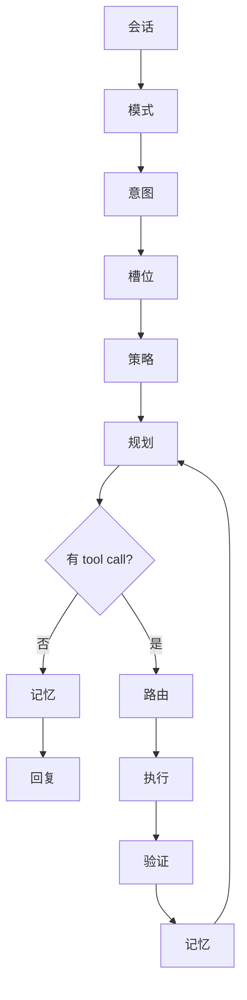

# Agent Loop

固定循环，不是可拖拽的图。入口是 `chat_send` → `core::start_turn`，循环在 `core::plan::run_agent_loop`。阶段顺序如下；没有单独实现的阶段，写的是现在实际落在这一步的行为。

```text
会话 → 模式 → 意图 → 槽位 → 策略 → 规划 → 路由 → 执行 → 验证 → 记忆 → 回复
```

有工具调用时，验证和记忆之后回到规划，直到模型不再调用工具或用户中止。

## 流程



## 会话

确保或新建会话。新建时可写入分组；若前端指定了 Agent，则预绑 `agent_id` 与对应 `workspace_dir`。未指定时 workspace 暂取全局默认 Agent，角色留给决策层（意图选角或用户稍后手选）。会话顶栏可切换主 Agent（`session_set_agent`），切换时同步 workspace。历史消息保存在该会话里。本轮注册中止通道，`chat_abort` 只置位。

## 模式

把前端传入的字符串收成 Ask、Agent、Search，缺省 Ask。选择存在本机 `localStorage`，不写入会话。

- Ask：不带工具，不注入知识库和技能。
- Search：不带工具，知识库最多 8 条。
- Agent：带内置工具和 MCP，注入技能，知识库最多 3 条。

## 意图

`intent::run` 只看用户原文，不看模式。结果是 `Intent`：类别（闲聊、工具执行、内容发布、账号查询、未识别）、置信度、命中关键词、来源、`needs_tools`。Agent 和 Search 把它写进系统提示词；置信度过低且未识别则不写。Agent 模式下，若会话尚未绑定且用户未手选角色，可用意图挑角色（置信度低于 0.5 不改角色）。用户手选或会话已绑定优先。不改变模式，也不短路循环。

## 槽位

当前没有槽位抽取，不从原句拆出平台、路径、账号等参数。和槽位最接近的是意图里的命中关键词，仍留在意图结果中，不单独填槽。

## 策略

决定这一轮能不能动工具，以及工具执行前怎么授权。只有 Agent 模式把工具定义放进模型请求。执行前按权限模式裁决 allow / ask / deny，可按会话记住；再叠加 Agent 覆盖和 workspace 约束。

## 规划

没有独立规划器。规划就是 `stream_chat`：模型决定直接回复，还是发出 tool call。请求前若上下文超过窗口约 85%，先截断旧消息。选模型发生在这一轮开始：会话绑定，其次手动激活，再次自动路由。用户中止与这次流式请求赛跑。

## 路由

模型请求失败时标记该 profile，下一轮可以换。成功且存在 tool call 时，按工具名分流：`spawn_agent`、MCP、内置工具（bash / read_file / write_file / web_fetch / search_files / glob_files）。同一轮里的多个工具按顺序路由，不并行。

## 执行

每个工具在权限通过后执行。文件操作限制在会话 workspace 内。`spawn_agent` 再跑一层短循环，最多 30 轮，不落库、不弹权限、不能再套子 Agent，工作目录不得超出父会话。

## 验证

没有单独的验收步骤。工具失败把错误内容写回；过长结果会截断。模型请求失败则中止本轮并记失败，不把错误当成正常回复。

## 记忆

用户消息、工具展示和助手回复写入会话并落库。知识库按模式注入提示词，不是每轮改写历史。本轮耗时、模式、意图和 token 写入会话链路。

## 回复

没有 tool call 时写入助手回复，发出结束，并带上本轮 token。有工具结果时不在这里结束，回到规划。

## 代码

| 层 | 位置 |
|---|---|
| 编排入口 | `src-tauri/src/core/turn.rs`（`start_turn`）+ `context.rs` / `pipeline.rs` |
| 会话 | `src-tauri/src/core/session/`（`run`） |
| 意图理解 | `src-tauri/src/core/intent/` |
| 决策/路由 | `src-tauri/src/core/decision/` |
| 规划编排 | `src-tauri/src/core/plan/` |
| 执行工具 | `src-tauri/src/core/execute/`（委托 `agents/dispatch.rs`） |
| 记忆/知识 | `src-tauri/src/core/memory/`、`chat/repository.rs` |
| 响应生成 | `src-tauri/src/core/response/` |
| 编排入口 | `src-tauri/src/chat/service.rs` |

分层流程图源文件在仓库 [`docs/drawio/`](../drawio/)（可导出 SVG 后挂到本站）。
